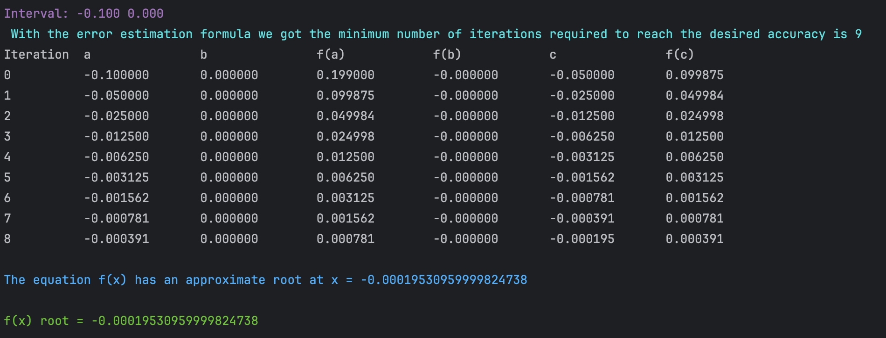
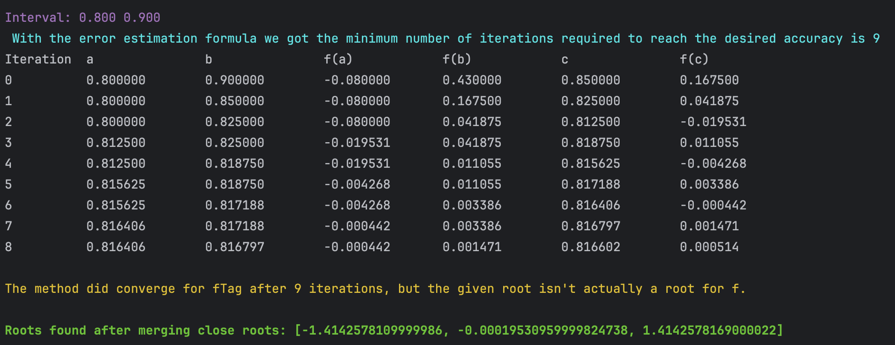

# Finding_Roots_Of_Equations
Second programming task of numerical analysis course

Those methods are used to find the roots of equations. The methods are:
1. Bisection Method
3. Newton-Raphson Method
4. Secant Method
Note that the methods finds roots that change sign f(a) * f(b) < 0

<h3 align="center">Basic example<h3>
<code>polynomial = x**3 - 2*x</code> 
<code>starting_point, ending_point = -3, 3</code> 
<code>search_range = generate_intervals(starting_point, ending_point, step=0.1)</code> 
<code>roots = []</code> 

<h2 align="left">Bisection Method</h2>

<h2 align="left">Newton-Raphson Method</h2>

<h2 align="left">Secant Method</h2>

